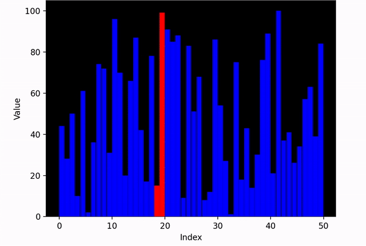

This is a Python program that demonstrates the Bubble Sort algorithm using a bar chart visualization. Bubble Sort is a simple sorting algorithm that repeatedly steps through the list to be sorted, compares each pair of adjacent items and swaps them if they are in the wrong order. The algorithm gets its name from the way smaller elements "bubble" to the top of the list.  The program generates a random unsorted array of integers and displays it using a bar chart. It then applies the Bubble Sort algorithm to the array and updates the bar chart at each step to show the current state of the array. The bars that are being compared in each step are highlighted in red to make it easier to follow the algorithm.  The program uses the Matplotlib library to create the bar chart and animate the sorting process. The bar chart is displayed in a dark mode to reduce eye strain, and the animation speed can be adjusted to suit your preference.  This program can be used as a learning tool to understand how Bubble Sort works, or as a visual aid for teaching others about sorting algorithms. The source code is provided so that you can modify it to suit your needs or use it as a starting point for your own visualization tools.

 
 

  

